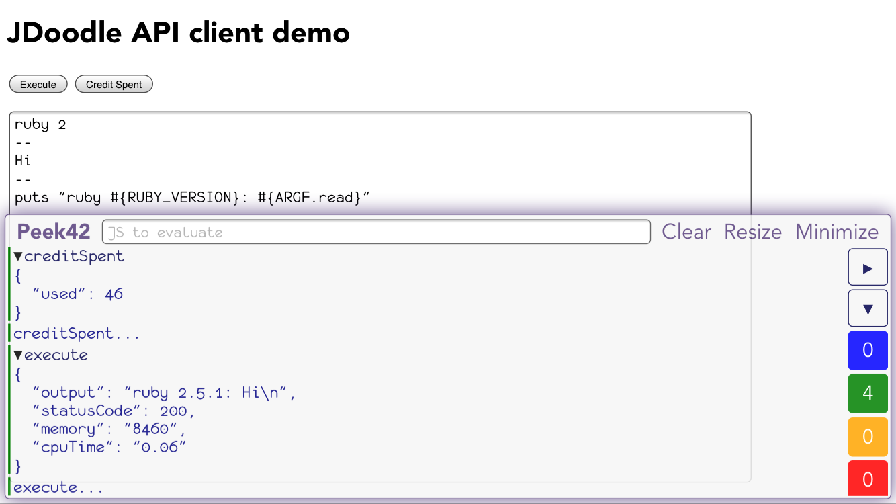

# JDoodle API Client

JavaScript [JDoodle API](https://www.jdoodle.com/compiler-api/docs) client



[comment]: # (## [Demo](https://rpeev.github.io/jdoodle-client/))

## Distribution

### Unpkg - [https://unpkg.com/jdoodle-client@latest/dist/](https://unpkg.com/jdoodle-client@latest/dist/)

- Node module (CJS) - [https://unpkg.com/jdoodle-client@latest/dist/jdoodle-client.node.js](https://unpkg.com/jdoodle-client@latest/dist/jdoodle-client.node.js)
- Browser bundle (UMD) - [https://unpkg.com/jdoodle-client@latest/dist/jdoodle-client.browser.js](https://unpkg.com/jdoodle-client@latest/dist/jdoodle-client.browser.js)
- Node ES module - [https://unpkg.com/jdoodle-client@latest/dist/jdoodle-client.node.mjs](https://unpkg.com/jdoodle-client@latest/dist/jdoodle-client.node.mjs)
- Bundlers/browsers ES module - [https://unpkg.com/jdoodle-client@latest/dist/jdoodle-client.browser.mjs](https://unpkg.com/jdoodle-client@latest/dist/jdoodle-client.browser.mjs)

## Install

### Node

```bash
npm install jdoodle-client
```

All distribution files are in `node_modules/jdoodle-client/dist/`

### Browser

```html
<script src="https://unpkg.com/jdoodle-client@latest/dist/jdoodle-client.browser.js"></script>
```

## Use

### Node

```javascript
const jdoodle = require('jdoodle-client');

// Use the jdoodle object
```

### Browser

```javascript
// Use the jdoodle (window.jdoodle) object
```

### ES module

```javascript
// Node
import jdoodle from 'jdoodle-client/dist/jdoodle-client.node';

// Bundlers
import jdoodle from 'jdoodle-client';

// Use the imports
```

## API

The following properties/functions are available through the **jdoodle** namespace object returned from `require('jdoodle-client')` on node or available as `window.jdoodle` in the browser (the ES module has the namespace object as default export):

- `version` - library version

See the **example** folder for node and browser examples respectively
